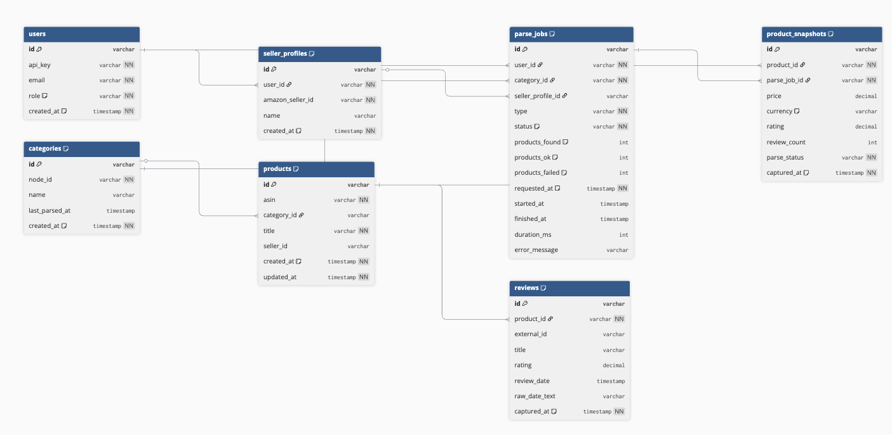
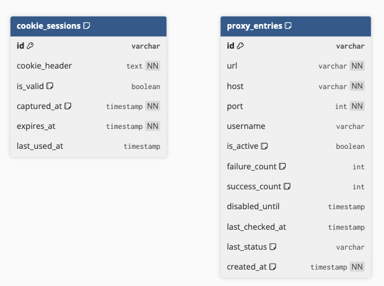

# amazon-service-back

## запуск
```bash
docker compose up -d --build

или 

make run

затем

make logs
```

---

## архитектура

```
src/
├── common/          —  ошибки, фильтры, перехватчики, константы
├── database/        — prisma сервис и репозитории
└── parser/
    ├── domain/      — типы, порты, доменные ошибки
    ├── adapters/    — реализации http, extractor, proxy, puppeteer
    ├── application/
    │   ├── commands/   — запускают парсинг
    │   ├── queries/    — читают результаты
    │   └── events/     — доменные события после парсинга
    └── entrypoints/ — контроллеры и dto валидация
```

---

## как работает парсинг

я использовал puppeteer + cherrio + axios 
puppeter отвечает за авторизацию, cherrio и axios за обработку http ответа и парсинга данных


### сценарий

curl -X POST http://localhost:3001/parser/trends \
  -H "Content-Type: application/json" \
  -d '{"nodeId": "172541"}'

1. запрос `POST /parser/trends` с nodeId контроллер кидает ParseCategoryTrendsCommand в шину
2. хендлер создаёт джоб в бд со статусом PENDING сразу переводит в RUNNING
3. возвращает jobId клиенту и не ждет парсинга
4. парсинг нужных данных
5. по завершении джоб переходит в DONE или FAILED
6. клиент отправляет запрос GET /parser/trends/:jobId и видит статус и данные

---

## рейтлимиты и баны

как я решал проблему рейтлимитов и банов

**ротация юзер агентов** каждый запрос берёт случайный юзер агент и viewmode. понимаю что это решение не гарантированно помогает избегать рейтлимитов, ввиду ограниченного времени на выполнение реализовал только такой функционал. 

**ротация прокси** по пулу прокси из `PROXY_LIST` выбирается случайная и испольщуется для конкретного запроса. если прокси падает 3 раза подряд товыключается на 5 минут.
если 5 запросов подряд упали — пауза 30 секунд перед следующей попыткой. 

**задержки динамичесие** — между запросом `/dp/ASIN` и `/product-reviews/ASIN` одного товара пауза 500 мс. 

**puppeteer только для логина** — браузер запускается один раз при старте, логинится в amazon со stealth плагином, отдаёт куки. все дальнейшие запросы идут через axios с этими куками.

также я добавил эндпоинты для проверки прокси и пересоздания сессии 
- `/admin/proxy-health` 
- `/admin/cookie-refresh`

---

## ошибки сети и таймауты

добавли прогрессирующие задержки 

насчет капчи: самого решения проблемы с ней я не сделал, думал над испольхованием СapMonster, но в нашем случае нужно реализовывать самостоятельное решение, зависеть от другого сервиса и рассчитывать наа его стабильность - плохо. но я добавли проверки если в html есть `validateCaptcha` то запрос помечается как `CAPTCHA`, товар сохраняется в бд с `parseStatus: CAPTCHA`. джоб не падает, продолжает следующие товары.

и даже если товар не спарсился, в бд создаётся снапшот с `parseStatus: CAPTCHA/PARSE_ERROR/NETWORK_ERROR`. так можно потом понять что именно упало и переспарсить именно эти товары.

---

добавил валидацию на случай если title пустой или рейтинг отсутствует то товар не сохраняется, логируется предупреждение

добавил parseStatus в снепшоте 

---

## логирование

- `HttpAdapter` — каждый запрос: метод, путь, статус, время, прокси
- `ParseJobRepository` — создание, смена статуса джоба
- `PrismaService` — все sql запросы с временем выполнения
- `SessionAdapter`: логин, сохранение куки, рефреш
- `ProxyAdapter` :загрузка пула, отключение проблемных прокси
- `LoggingInterceptor`: каждый запрос к апи


---

## база данных

продукты разделены на две таблицы products и product_snapshots. в продуктах лежит то что не меняется по типу эйсин и название. в снапшотах — всё что меняется со временем: цена, рейтинг, количество отзывов. каждый парсинг создаёт новый снапшот, старые не трогает. так автоматически получается история изменений без дублирования данных.

отзывы в отдельной таблице с уникальным ограничением на пару продукт и внешний айди. при повторном парсинге дубли не создаются а один запрос с флагом пропускает дубли.
категории нормализованы как один айди категории и одна запись. поле lastParsedAt в будущем для когда добавления автоматического повторного парсинга устаревших категорий.

добавлю также авторизацию пользователей и хранение их уникальныъ данных, сейчас в демо режиме используется только один юзер

индексы

на снапшотах индекс по продукту и дате нужен для истории цены конкретного товара за период. 

на джобах индекс по юзеру и статусу нужен чтобы быстро найти активные джобы без сканирования всей таблицы. 

на отзывах индекс по продукту и дате отзыва нужен для выборки за период. 

на прокси индекс по активности и дате отключения нужен чтобы за один запрос получить список живых прокси. 


---

## api

| метод | путь | описание |
|-------|------|----------|
| POST | /parser/trends | запустить парсинг трендов категории |
| GET | /parser/trends/:jobId | статус и результаты джоба |
| POST | /parser/competitors | запустить парсинг конкурентов |
| GET | /parser/competitors/:jobId | статус и результаты |
| POST | /parser/own-products | запустить парсинг своих товаров |
| GET | /parser/own-products/:jobId | статус и результаты |
| GET | /admin/stats | общая статистика системы |
| GET | /admin/proxy-health | статус прокси с live проверкой |
| GET | /admin/cookie-status | статус amazon сессий |
| POST | /admin/cookie-refresh | принудительный рефреш куки |

примеры curl

```
# запустить парсинг трендов категории
curl -X POST http://localhost:3001/parser/trends \
  -H "Content-Type: application/json" \
  -d '{"nodeId": "172541"}'

# ответ: {"ok":true,"jobId":"uuid"}

# проверить статус и результаты джоба
curl http://localhost:3001/parser/trends/JOB_ID

```

## схема базы данных

### er-диаграмма

основные сущности и связи между ними:



сессии и инфраструктурные таблицы:



---

### prisma схема
```prisma
generator client {
  provider = "prisma-client"
  output   = "../src/generated/prisma"
}

datasource db {
  provider = "postgresql"
}

model User {
  id             String          @id @default(uuid())
  apiKey         String          @unique @default(uuid())
  email          String          @unique
  role           UserRole        @default(USER)
  createdAt      DateTime        @default(now())
  parseJobs      ParseJob[]
  sellerProfiles SellerProfile[]

  @@index([apiKey])
  @@map("users")
}

model SellerProfile {
  id             String     @id @default(uuid())
  userId         String
  amazonSellerId String
  name           String?
  createdAt      DateTime   @default(now())
  user           User       @relation(fields: [userId], references: [id], onDelete: Cascade)
  parseJobs      ParseJob[]

  @@unique([userId, amazonSellerId])
  @@index([amazonSellerId])
  @@map("seller_profiles")
}

model Category {
  id           String     @id @default(uuid())
  nodeId       String     @unique
  name         String?
  lastParsedAt DateTime?
  createdAt    DateTime   @default(now())
  parseJobs    ParseJob[]
  products     Product[]

  @@index([nodeId])
  @@map("categories")
}

model ParseJob {
  id              String            @id @default(uuid())
  userId          String
  categoryId      String
  sellerProfileId String?
  type            ParseJobType
  status          ParseJobStatus    @default(PENDING)
  productsFound   Int               @default(0)
  productsOk      Int               @default(0)
  productsFailed  Int               @default(0)
  requestedAt     DateTime          @default(now())
  startedAt       DateTime?
  finishedAt      DateTime?
  durationMs      Int?
  errorMessage    String?
  user            User              @relation(fields: [userId], references: [id])
  category        Category          @relation(fields: [categoryId], references: [id])
  sellerProfile   SellerProfile?    @relation(fields: [sellerProfileId], references: [id])
  snapshots       ProductSnapshot[]

  @@index([userId, status])
  @@index([categoryId])
  @@index([requestedAt])
  @@map("parse_jobs")
}

model Product {
  id         String            @id @default(uuid())
  asin       String            @unique
  categoryId String?
  title      String
  sellerId   String?
  createdAt  DateTime          @default(now())
  updatedAt  DateTime          @updatedAt
  category   Category?         @relation(fields: [categoryId], references: [id])
  snapshots  ProductSnapshot[]
  reviews    Review[]

  @@index([asin])
  @@index([categoryId])
  @@index([sellerId])
  @@map("products")
}

model ProductSnapshot {
  id          String      @id @default(uuid())
  productId   String
  parseJobId  String
  price       Decimal?    @db.Decimal(10, 2)
  currency    String      @default("USD")
  rating      Decimal?    @db.Decimal(3, 2)
  reviewCount Int?
  parseStatus ParseStatus
  capturedAt  DateTime    @default(now())
  product     Product     @relation(fields: [productId], references: [id], onDelete: Cascade)
  parseJob    ParseJob    @relation(fields: [parseJobId], references: [id])

  @@index([productId, capturedAt])
  @@index([parseJobId])
  @@index([capturedAt])
  @@map("product_snapshots")
}

model Review {
  id          String    @id @default(uuid())
  productId   String
  externalId  String?
  title       String?
  rating      Decimal?  @db.Decimal(3, 2)
  reviewDate  DateTime?
  rawDateText String?
  capturedAt  DateTime  @default(now())
  product     Product   @relation(fields: [productId], references: [id], onDelete: Cascade)

  @@unique([productId, externalId])
  @@index([productId, reviewDate])
  @@index([reviewDate])
  @@map("reviews")
}

model ProxyEntry {
  id            String      @id @default(uuid())
  url           String      @unique
  host          String
  port          Int
  username      String?
  isActive      Boolean     @default(true)
  failureCount  Int         @default(0)
  successCount  Int         @default(0)
  disabledUntil DateTime?
  lastCheckedAt DateTime?
  lastStatus    ProxyStatus @default(UNKNOWN)
  createdAt     DateTime    @default(now())

  @@index([isActive, disabledUntil])
  @@index([lastStatus])
  @@map("proxy_entries")
}

model CookieSession {
  id           String    @id @default(uuid())
  cookieHeader String    @db.Text
  isValid      Boolean   @default(true)
  capturedAt   DateTime  @default(now())
  expiresAt    DateTime
  lastUsedAt   DateTime?

  @@index([isValid, expiresAt])
  @@map("cookie_sessions")
}

enum UserRole {
  USER
  ADMIN
}

enum ParseJobType {
  OWN_PRODUCTS
  COMPETITORS
  CATEGORY_TRENDS
}

enum ParseJobStatus {
  PENDING
  RUNNING
  DONE
  FAILED
}

enum ParseStatus {
  OK
  CAPTCHA
  PARSE_ERROR
  NETWORK_ERROR
}

enum ProxyStatus {
  UNKNOWN
  OK
  BANNED
  DEAD
}
```